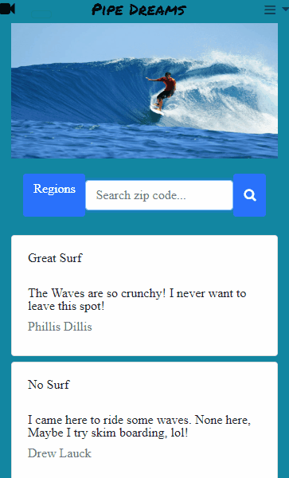
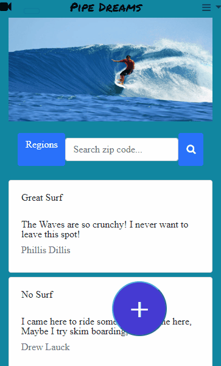

# PIPE DREAMS

[Link to Application](https://thawing-ravine-33756.herokuapp.com/)

### A surfer's mobile friendly companion app for viewing the waves and interacting with the watersports community

## Technologies Used
Express, Node.js, MySQL, Handlebars, Javascript, JQuery, HTML, CSS, Passport, Bootstrap, Heroku, JawsDB MySQL

## APIs Used
OpenWeather, Webcamstravel

## App Description
Navigate the app using the filters to show posts from different regions or enter location info (zip code) to show weather conditions and live feed of the beach view. 

## *Click the menu button to sign up or login*

## *Enter your zip code for weather info and a live feed of the nearest beach!*

## *Use the filter buttons to sort through posts* 

## *Click the "PLUS" icon to create a new post* 

##### *Deployed on Heroku*